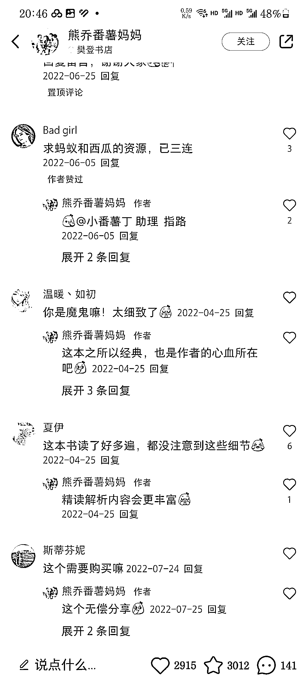
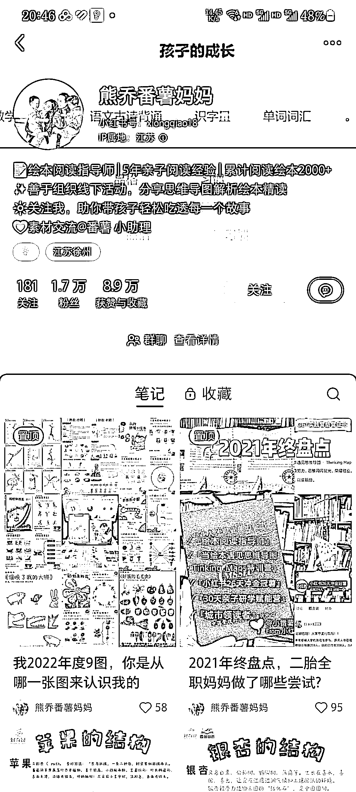
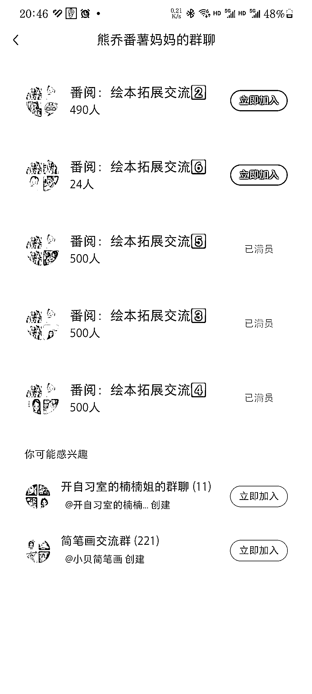

# 绘本思维导图：吸引流量、卖书、引流卖课的新趋势

> 原文：[`www.yuque.com/for_lazy/xkrm14/iyp0semrrxra1zc7`](https://www.yuque.com/for_lazy/xkrm14/iyp0semrrxra1zc7)

作者： 冷寒冰

日期：2023-11-27

点赞数：**51**

* * *

正文：

思维导图细分市场-绘本类思维导图，现在很多父母都会给子女读绘本，这类账号会把绘本以思维导图的方式做个总结来吸引流量，可以卖书，也能引流卖课。

* * *

评论区：

* * *

公众号懒人找资源，懒人专属群分享