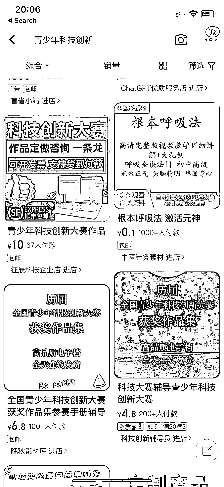

# 青少年科技创新市场潜力大，小红书成为赚钱新途径

> 原文：[`www.yuque.com/for_lazy/xkrm14/rtugwwzx6meuc6zs`](https://www.yuque.com/for_lazy/xkrm14/rtugwwzx6meuc6zs)

作者： 胡恩惠

日期：2023-11-27

点赞数：**34**

* * *

正文：

青少年科技创新 推荐理由：现在小学生/中学生也很内卷，各种比赛/创赛层出不穷，但是对于很多家长来说难度比较大，于是就有了指导/代做的市场
淘宝/小红书等全平台可以做 小红书也有一些博主专门做小学/中学创赛指导 如果想做这个选品，有了单子交给上游技术团队，自己只做流量
可以在小红书上引流，通过和技术团队合作，就可以形成闭环，以此来赚钱

* * *

评论区：

* * *

公众号懒人找资源，懒人专属群分享