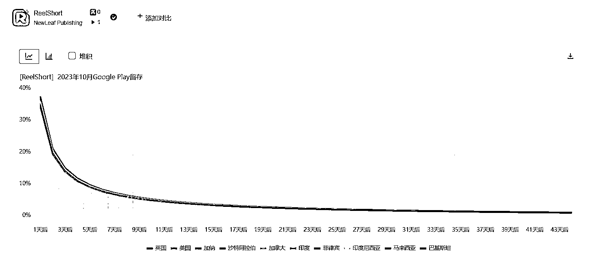

# 短剧出海：欧美市场自制短剧数量有限，但预计将在年底迎来大爆发

> 原文：[`www.yuque.com/for_lazy/xkrm14/noaq8svuakyryam6`](https://www.yuque.com/for_lazy/xkrm14/noaq8svuakyryam6)

作者： 浩野

日期：2023-11-27

点赞数：**29**

* * *

正文：

目前短剧出海 App 的一个普遍特点是海外自制短剧的数量并不多。尤其是面向欧美市场的英文自制短剧的数量集中在十几部到二十几部之间，这部分内容大概 20-40
小时左右就能看完，这个内容体量对比目前国内头部短剧平台动辄数千部的内容储备是比较少的。我们此前倾向认为是“产能”原因，现在内容储备不够多还是因为很多公司的短剧出海业务也刚刚开始了半年，时间不长。北美目前有数百个剧组在拍摄短剧，预计年底库存的情况将会大大改观。或许短剧出海在年底或者明年会迎来大爆发。

* * *

评论区：

* * *

公众号懒人找资源，懒人专属群分享