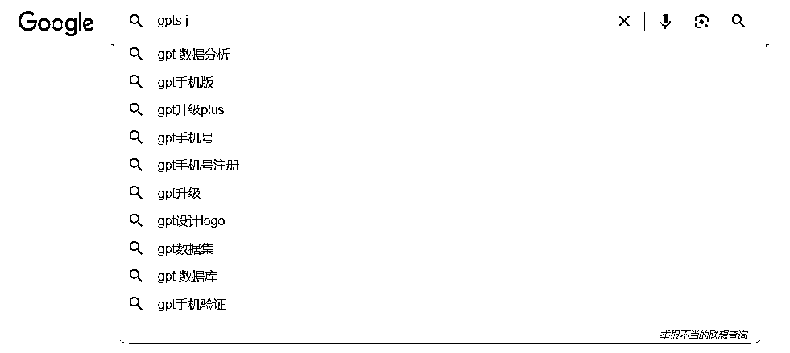
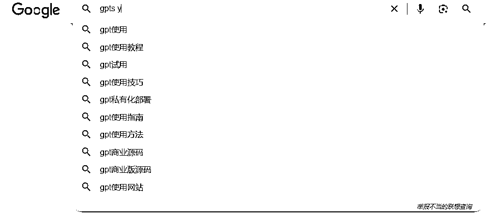

# 用亦仁分享的用户搜索热门关键词找需求的方法

> 原文：[`www.yuque.com/for_lazy/xkrm14/ytvf4gvimeuqa4r9`](https://www.yuque.com/for_lazy/xkrm14/ytvf4gvimeuqa4r9)

作者： 梅丽玲

日期：2023-11-30

点赞数：**49**

* * *

正文：

用亦仁分享的用户搜索热门关键词找需求的方法，在 google 搜索 gpts 的需求，从 gpts a-z，汇总的需求方法有： 1.gpts 应用商店，商业源码
2.使用教程：使用方法与技巧，推文 or 视频形式， 3.gpts 账户，手机版，升级，部署 4.生成内容 :图片，prompt， ppt,
思维导图，流程图等 5.gpts 在特定领域的应用：医学、算命、girlfriend 等

* * *

评论区：

张达达 : 亦仁哪里分享了？求原帖？[调皮]

梅丽玲 : 风向标航海手册有。或者亦仁的公众号，亦无所知。

梅丽玲 : 感谢老大

* * *

公众号懒人找资源，懒人专属群分享