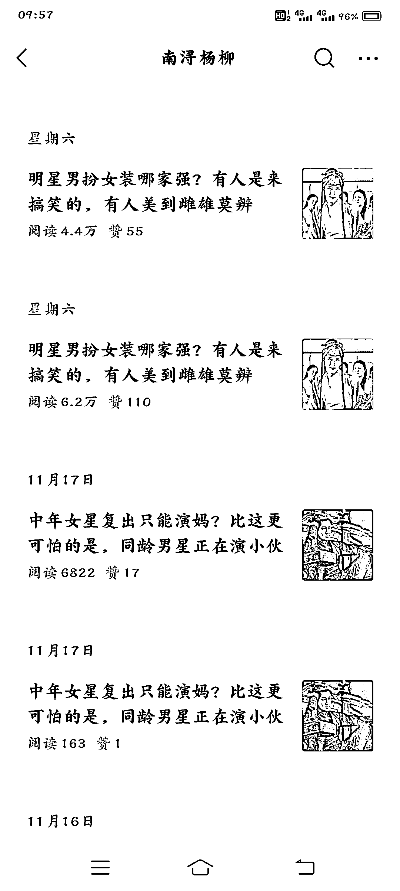

# 公众号爆文玩法：连怼连爆，流量薅干薅尽

> 原文：[`www.yuque.com/for_lazy/xkrm14/wgt3gq3z9926e8g5`](https://www.yuque.com/for_lazy/xkrm14/wgt3gq3z9926e8g5)

作者： 钢哲

日期：2023-11-27

点赞数：**58**

* * *

正文：

公众号爆文玩法之连怼连爆:和视频号、小红书的连怼连爆相似，把当天的文章连着发两次，第二次发表的文章阅读量甚至比第一次还要高，把单篇内容的流量薅干薅尽。

* * *

评论区：

肖深刻 : 自己隔天的文章呢？还有后面连怼的文章是否开了原创

兰心 : 公众号也能这样干啊，开眼界了

白菜 : 如果每天这样怼满 8 篇，过份么[得意]

能量菌 : 一天不是只能发一次嘛

小刀 : 我也有这个疑问？

折扇书生 : 只能发一次群发，后面发可以不群发的发布

云七 : 电商可以这样搞吗[偷笑]

* * *

公众号懒人找资源，懒人专属群分享