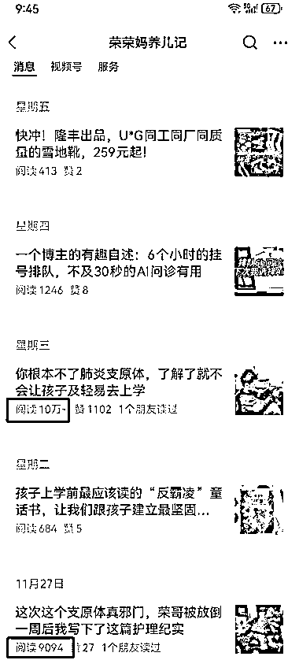

# 肺炎支原体传播严重，全职宝妈通过公众号赚取高流量

> 原文：[`www.yuque.com/for_lazy/xkrm14/rh907urol1ue0cdk`](https://www.yuque.com/for_lazy/xkrm14/rh907urol1ue0cdk)

作者： 代一

日期：2023-12-05

点赞数：**53**

* * *

正文：

最近肺炎支原体传播严重，相关文章流量很大。 看到一个全职宝妈做的公众号，出了一篇 10 万+，此类话题的阅读也比平时高。
她主要以孩子妈妈给孩子看病护理的角度来写，很接地气。 变现方式我看有流量主，社群带货，微店做母婴家居类产品的销量也挺高。

* * *

评论区：

代一 : 感谢亦仁老大[嘿哈]

Cobb : 应该属于热点类了

* * *

公众号懒人找资源，懒人专属群分享