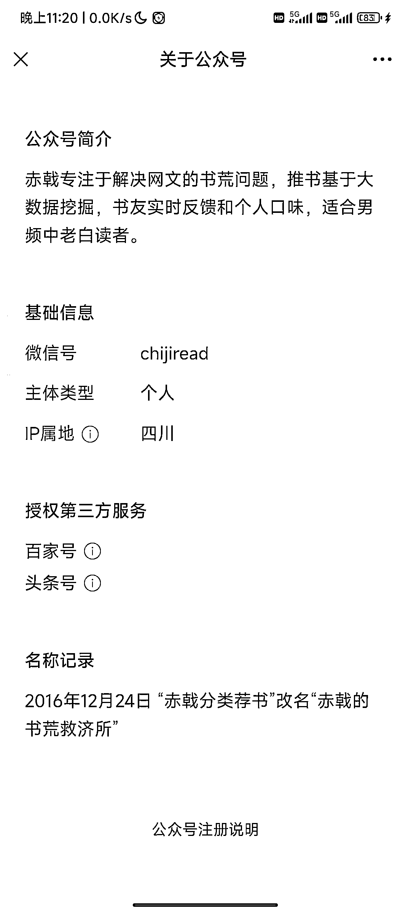
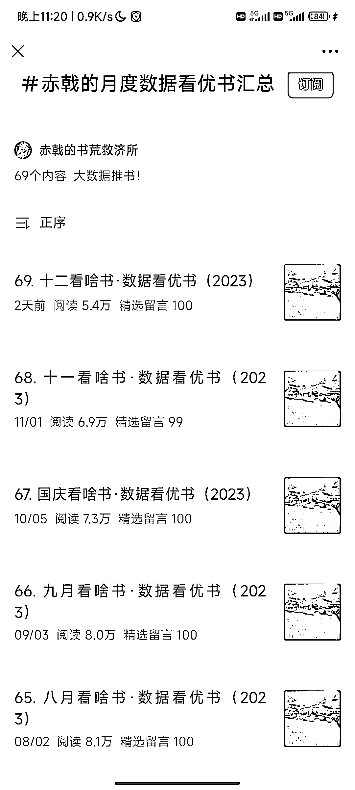
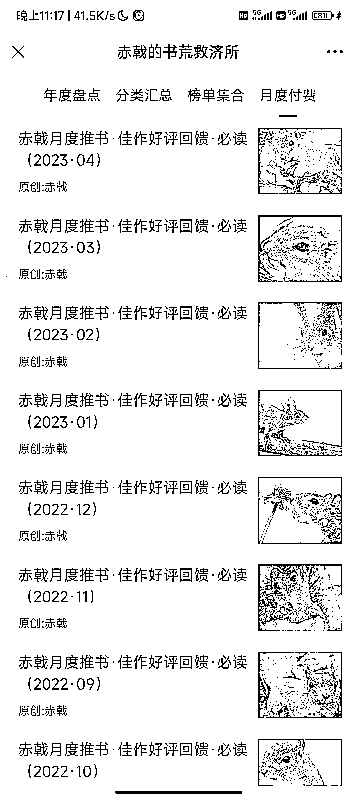

# 解决网文书荒问题，基于大数据挖掘的推书平台受欢迎

> 原文：[`www.yuque.com/for_lazy/xkrm14/gc9glk8n6s4n0nd9`](https://www.yuque.com/for_lazy/xkrm14/gc9glk8n6s4n0nd9)

作者： 北柱

日期：2023-12-04

点赞数：**67**

* * *

正文：

专注于解决网文的书荒问题，推书基于大数据挖掘，书友实时反馈和个人口味，适合男频中老白读者。
评论区很活跃，都在讨论小说。公众号每个月发一篇付费文章，每篇收费 1 元，付费人数基本都是 1W+。

* * *

评论区：

新德里的早岑 : 这种大号没有任何参考意义

* * *

公众号懒人找资源，懒人专属群分享