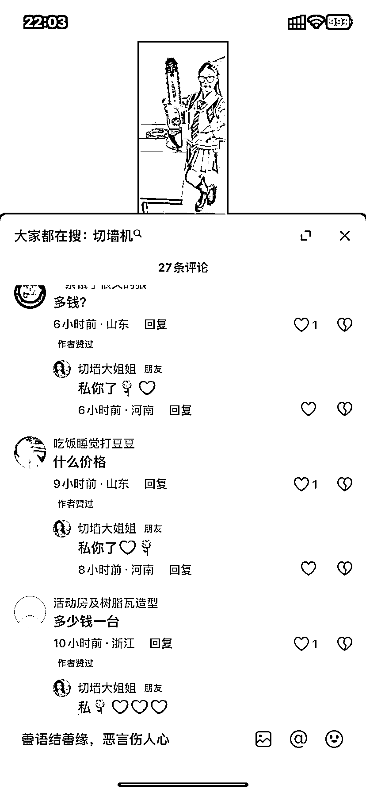
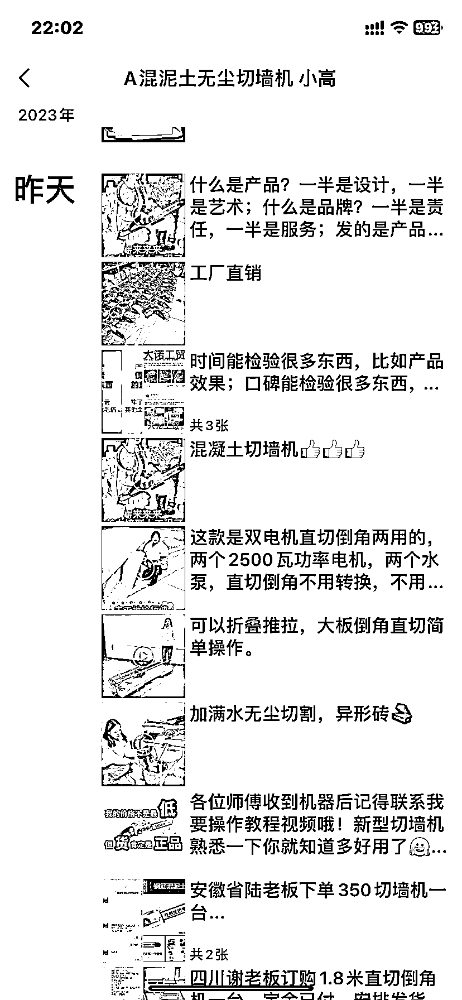
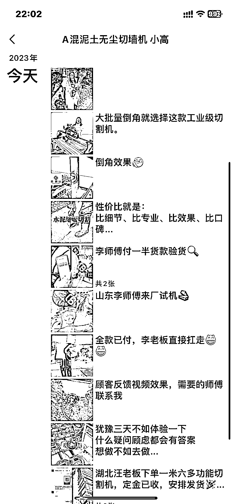

# 利用社群运营，卖高客单价产品，赚取丰厚利润

> 原文：[`www.yuque.com/for_lazy/xkrm14/wb47eyuet575kk7k`](https://www.yuque.com/for_lazy/xkrm14/wb47eyuet575kk7k)

作者： bgz 洲洲

日期：2023-12-05

点赞数：**72**

* * *

正文：

前阵子看了 分享的《帮厂家带货—卖豆浆机 20 天赚 9000+》，我就找了很多类似的产品，农村人群、中老年人使用、小商小贩使用、尤其是临近年关使用的产品-
灌肠机，东北杀猪、杀鸡鸭鹅用的工具，发现了很多可以玩的高客单价产品，像下图中的切墙机，就是一个很好的产品，抖音、快手、视频号发视频引流私域微信成交，付定金货到付尾款。看评论区市场需求很大。[知识星球
| 深度连接铁杆粉丝，运营高品质社群，知识变现的工具](https://wx.zsxq.com/dweb2/index/topic_detail/188442544422552) 

* * *

评论区：

bgz 洲洲 : 山东、河北有很多做工业产品的小厂家，其实他们没有专业的互联网运营人员，都可以找这种产品，做制造业无货源带货

才 : 货源还是在 1688 上去找吗？

bgz 洲洲 : 1688、淘宝、拼多多都可以

辰风 : 牛的

* * *

公众号懒人找资源，懒人专属群分享