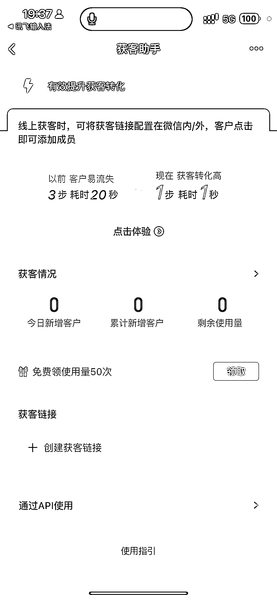

# 企业微信内测功能：获客助手，直接链接加好友，省去扫描二维码的步骤

> 原文：[`www.yuque.com/for_lazy/xkrm14/dc9mxarmmbn7gvyc`](https://www.yuque.com/for_lazy/xkrm14/dc9mxarmmbn7gvyc)

作者： 雨轩

日期：2023-12-05

点赞数：**33**

* * *

正文：

企业微信内测功能，获客助手 直接链接加好友
连扫二维码都省了，还支持多账号轮询切换，一个链接可以分流加几十个客服，支持设置欢迎语，客户通过链接加过来的可以设置特殊标签，支持链接随机跳转多客服分流，支持添加验证。

* * *

评论区：

吕加薪 : 🐮

解忧杂货铺 : 一个添加一块钱

倪大胖 : 多谢提醒

雨轩 : 感谢亦仁老大[得意]

张小厨 : 太贵了，没人用，现在都是第三方辅助

* * *

公众号懒人找资源，懒人专属群分享