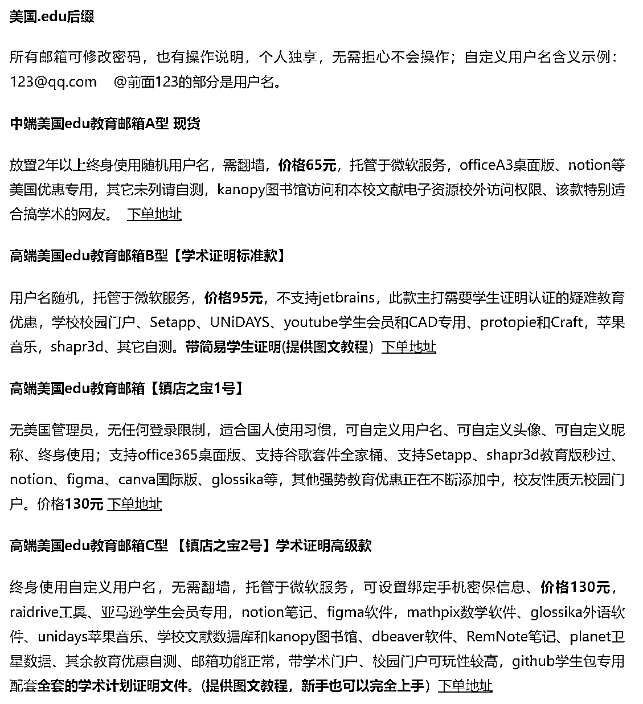

# 国外 edu 教育邮箱服务：免费享受付费软件的使用权限

> 原文：[`www.yuque.com/for_lazy/xkrm14/dev33xh7tb57afw4`](https://www.yuque.com/for_lazy/xkrm14/dev33xh7tb57afw4)

作者： bug 超会玩

日期：2023-12-08

点赞数：**74**

* * *

正文：

国外 edu 教育邮箱服务。 用 edu 邮箱，可以免费申请教育优惠系列产品。 例如：office 全家桶，adobe 全家桶、jetbrain
全家桶的使用权限，notion，figma 等软件的会员权益。 主要是付费软件的免费使用，付费 plan 的免费使用。 目前单个邮箱，价格在 50 - 150
元范围。 项目的门槛，是搞定国外相关学校的资质。 购买 edu 域名，搭建邮箱服务。 推广曝光，转化成交等。
这是近期观察到的一个生意，大家有能力一定支持正版软件。

* * *

评论区：

稳一手 : 一直没太懂这里面的逻辑。照理说，愿意为这种邮箱付费的，就是不愿意入正呗，那直接整破解版不就完事。

知新 : 用这种教育版，本身还是想买正版，是想买便宜的正版吧。而且有时候硬件也是对学生有优惠。

嗯哼 v5 : 怎么入手呀

静水流深 : 都是黑来的信箱，你居然觉得搞定国外相关学校资质？

bug 超会玩 : 那就是卖家话术，没去考证。 他们说去注册了一个美容美发学校😂

静水流深 : hostloc 上哈佛大学的都有，貌似我也有，杜克，乔治城的我也有，其实最大意义是薅 Github 的学生包。

时光 : 这个有研究过，教育邮箱有两个后缀的，edu 和 ac，ac 好弄一些，再整个无限生成小号的邮箱系统售卖，年成本就是几百元，但是一个号售卖价格就是几十上百。很多软件都是学生免费，教育版

* * *

公众号懒人找资源，懒人专属群分享