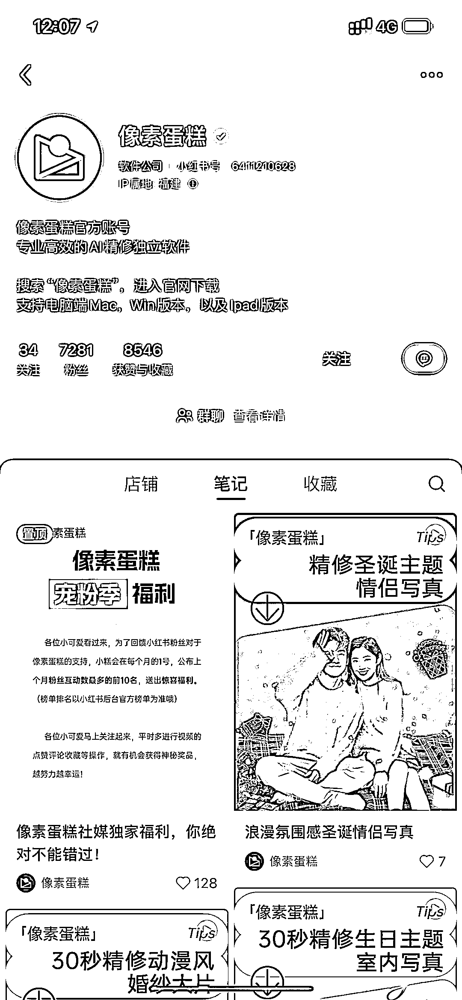

# 小红书店铺推出 AI 精修图软件，受欢迎程度和需求量大

> 原文：[`www.yuque.com/for_lazy/xkrm14/bd49odsedwzabs7t`](https://www.yuque.com/for_lazy/xkrm14/bd49odsedwzabs7t)

作者： 颜若一

日期：2023-12-13

点赞数：**51**

* * *

正文：

小红书店铺卖 AI 精修图，后端有 ipad、mac 和 win 版本软件承接客户订单，需求量大，效果也不错

* * *

评论区：

林林 AIGC 写作 : 这个技术门槛不高，之前也有圈友发过 P 路人的项目中标了。就是安装 PS AI 版本就能实现这一功能。

林林 AIGC 写作 : 哈哈哈哈哈哈 你中标的下面的一条中标的风向标就是 [`t.zsxq.com/15QJ9bPuR`](https://t.zsxq.com/15QJ9bPuR) 

颜若一 : 感谢亦仁大大[爱心]

颜若一 : [呲牙]

颜若一 : 嗯嗯，转化和思路都不错

* * *

公众号懒人找资源，懒人专属群分享