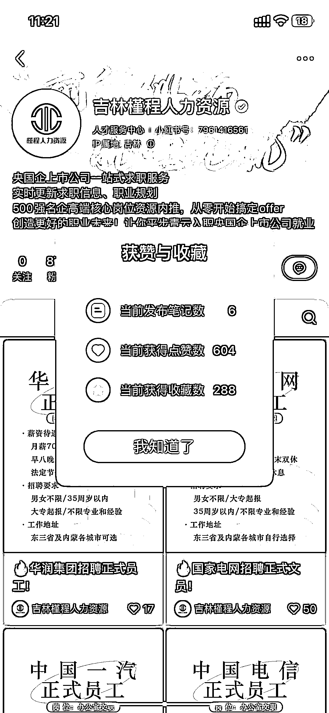
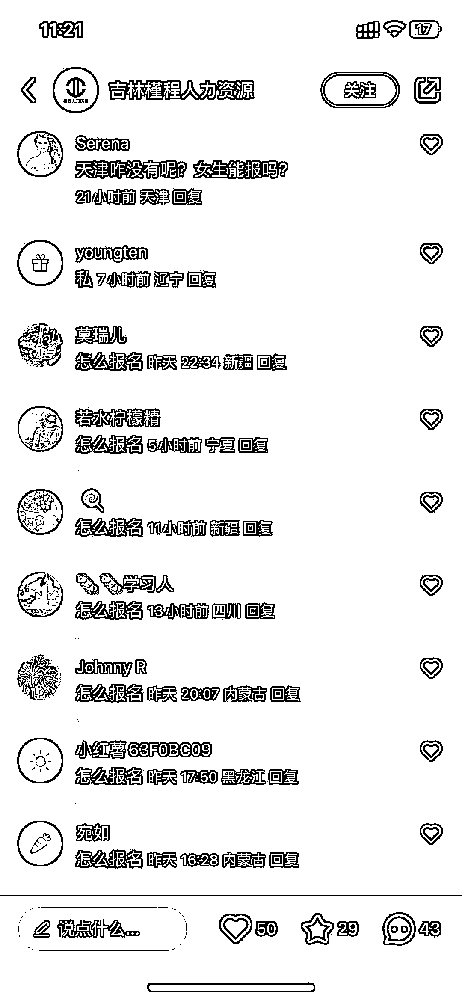
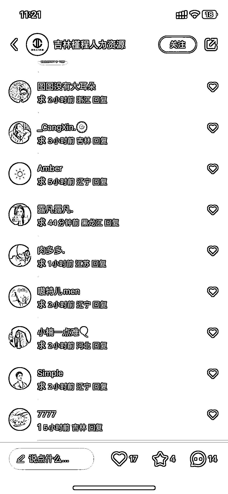

# 小红书上发布的招聘信息受关注度高，粉丝数量迅速增长

> 原文：[`www.yuque.com/for_lazy/xkrm14/hhrh7omo9muzwcph`](https://www.yuque.com/for_lazy/xkrm14/hhrh7omo9muzwcph)

作者： 柠檬

日期：2023-12-11

点赞数：**48**

* * *

正文：

小红书上发布一些招聘信息关注度还挺高的 这个号 6 篇笔记涨了 800 多粉丝 下面全都是求的

* * *

评论区：

少喝冰水 : 这种后续怎么变现好呢

广州大学 啊泽 : 改简历

柠檬 : 我想了一个 找一些可以内推的在职员工 然后推给他们 成了收中介费 不知道可不可行

少喝冰水 : 可以内推的员工 这个应该不太好找[囧]

柠檬 : 是的 所以要想办法找到这些

* * *

公众号懒人找资源，懒人专属群分享