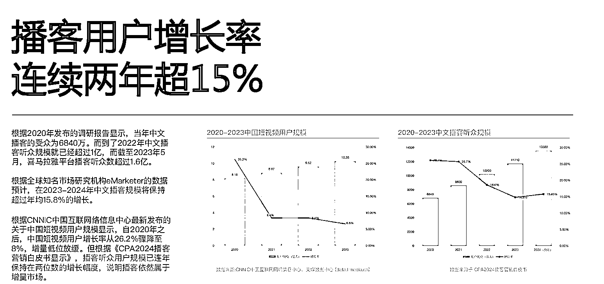
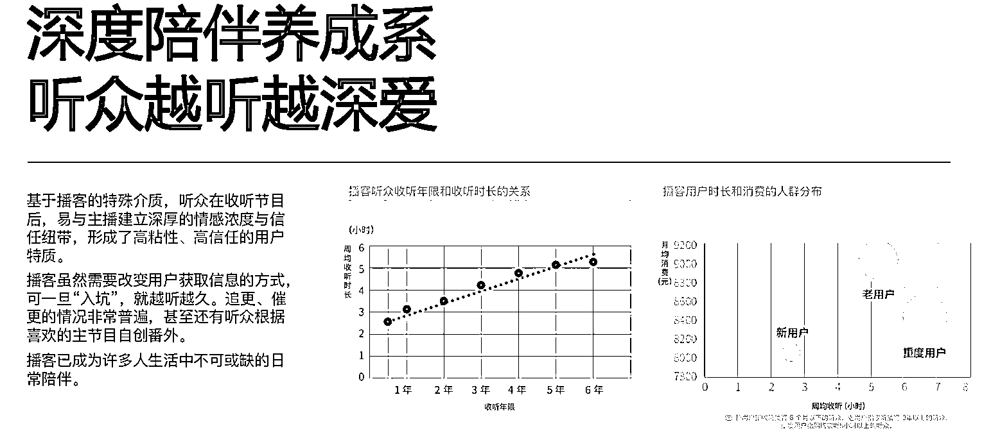

# 播客用户增长率连续两年超 15%，成为新的引流平台

> 原文：[`www.yuque.com/for_lazy/xkrm14/bp0mvpdt55th0tn7`](https://www.yuque.com/for_lazy/xkrm14/bp0mvpdt55th0tn7)

作者： 张波

日期：2023-12-14

点赞数：**80**

* * *

正文：

播客用户增长率连续两年超 15%，预计可以成为新的引流平台
目前市场：2020 年发布的调研报告显示，当年中文播客的受众为 6840 万。而到了 2022 年中文播客听众规模就已经超过 1 亿，而截至 2023 年 5 月，喜马拉雅平台播客听众数超过 1.6 亿。根据《CPA2024 播客营销白皮书显示》，播客听众用户规模已连年保持在两位数的增长幅度，说明播客依然属于增量市场。
内容题材：用户需求拉动：拓新见识的认知需求，倾听陪伴的情感需求日渐增强 1、反大数据的精神养生需求
基于大数据的推送机制，更像是一层“信息革房”，多巴胺式的娱乐方式让人开始疲惫。寻求“精神养生”的青年们开始寻找自己可控的信息获取渠道 2、自我成长与探索热潮
播客的优质内容，帮助听众打破信息差，刺激思考，让想法创意不断吸收和外溢，实现内啡脑的长期满足。 3、工作环境及生活方式变化驱动
后疫情时代，办公模式更加多元与灵活，且创造副业、自由职业等工作场景日益丰富，加之当代青年独居独处的生活需求，间接丰富了收听场景，也增加了收听时长
4、情绪陪伴需求升温迅速
后疫情时代，年轻人对于情感价值陪伴的需求增强。根据中国青年报的一份报道显示，80.23%的年轻人感受到他人陪伴对自己的重要性。基于播客这种特殊的介质，强陪伴感也让不少人纷纷入坑。
主要商机：各种鸡汤领域的作者，都可以尝试一下，目前人群还是有的。

* * *

评论区：

* * *

公众号懒人找资源，懒人专属群分享