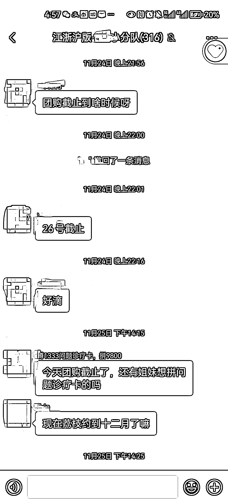

# 医美直播带货模式存在问题，精品医院团购成新趋势

> 原文：[`www.yuque.com/for_lazy/xkrm14/guusgvngdslkqdnb`](https://www.yuque.com/for_lazy/xkrm14/guusgvngdslkqdnb)

作者： 李。

日期：2023-12-11

点赞数：**38**

* * *

正文：

医美直播风很大，很多医院由原先的渠道带客高返点模式转向医美主播直播带货模式，但依然存在着高佣金低利润或团队自重大收益低的问题。
陆续新出现两三个做精品医院团购的模式，团长了解本地或周边医院且自身经验丰富，主打小且精的私域团购，针对性强灵活度高，针对客群需求和医院特色去洽谈不同的卡项，服务及售后更高效～
医院利润空间相较于大主播更大，也更能推出自家特色和优势项目，可控的客户数量服务更好。 客群黏性高，复购高，转化率更高。
团长由微博分享导流到私域，按城市开群，目前关注到的 2 个基本 5-15 个群不等，每个群人数均在 300-500 人，每次卡项价格主要在 1000-20000/张，每月开 1-3 场，适合医美项目体验较多较了解，有相关账号或私域的开团去做，利润可观。

* * *

评论区：

亚瑟王 : 万物皆可团

李。 : 哈哈确实是

desky : 医美直播风控比较严格，但目前仍然可以做，我这有稳定的医美供应链，有想做相关流量转化的可以联系我。另外这种开团模式对区域团比较友好，直播适合流量分布广泛或者想借助平台流量的大团

* * *

公众号懒人找资源，懒人专属群分享