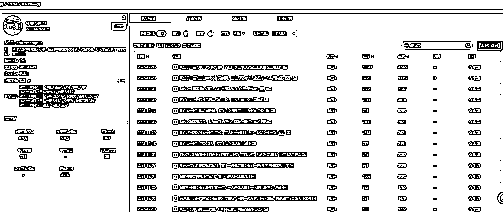

# 最猛的新公众号，近一个月 20 篇以上 100W+阅读量

> 原文：[`www.yuque.com/for_lazy/xkrm14/ginoyfvtppoyxsup`](https://www.yuque.com/for_lazy/xkrm14/ginoyfvtppoyxsup)

作者： 张稳健

日期：2023-12-19

点赞数：**101**

* * *

正文：

公众号下场两个多月以来看见最猛的新号！ 根据点赞倒推阅读量，近一个月 100W+最少 20 篇以上！

* * *

评论区：

Tony : 请问这个是什么软件

张稳健 : 次幂数据，之前有篇帖子聊过，可以翻来看下

Tony : 谢谢

张稳健 : 按流程操作，可白嫖一天试用[`t.zsxq.com/15UxYWlMS`](https://t.zsxq.com/15UxYWlMS)

lzj 杰 : 等 12 月份航海看一下有没有圈友拼单，次幂数据专业版，1 年打折后，算上子账户，一个月 50 元左右/人，算起来比较划算。

张稳健 : 666

林清杰 : 多打了个 0

张稳健 : 没打错哈，超过 10W 的文章网站只能显示 10W+。正常 10W+文章，40 到 100 赞，根据点赞可以倒推一下哈，近一个月百万加肯定超过 20 篇了！

* * *

公众号懒人找资源，懒人专属群分享