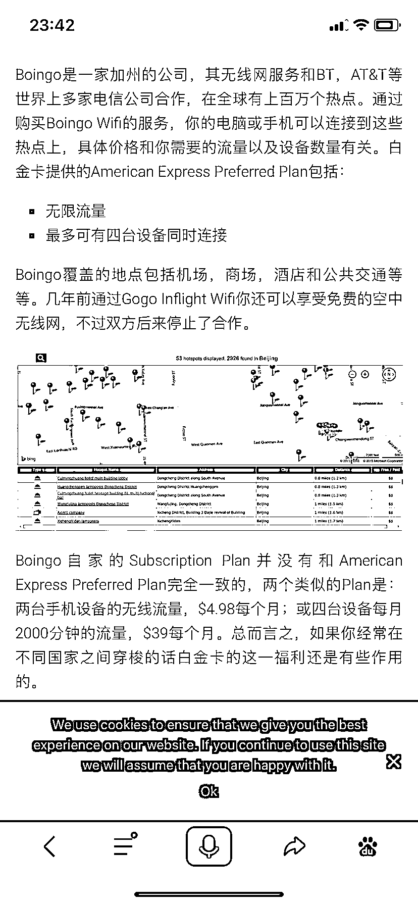

# 小众蓝海赛道：飞机上上网 Wi-Fi 合作，一单赚 100+

> 原文：[`www.yuque.com/for_lazy/xkrm14/smiab15i8m9hvlw9`](https://www.yuque.com/for_lazy/xkrm14/smiab15i8m9hvlw9)

作者： 广州大学 啊泽

日期：2023-12-20

点赞数：**69**

* * *

正文：

小众蓝海赛道 可以在飞机上上网的 Wi-Fi，寻求合作。 一单赚 100➕ 目前考察情况：在闲鱼上搜索关键字仅有 16 个帖子在出售 Wi-Fider
年卡，想要的人人多，于是我发布帖子三个小时内，曝光度就有几千。 当天晚上就同步给了简历训练营的伙伴。他们就在闲鱼上发布帖子，第二天一早就有出单。

* * *

评论区：

广州大学 啊泽 : 找到了后端资源 可合作呀

啊吹(不二) : 全航线支持吗，链接一下[转圈]

广州大学 啊泽 : 可以 ZEC924

高超 : 是只能在美国用吗

广州大学 啊泽 : 全世界

* * *

公众号懒人找资源，懒人专属群分享