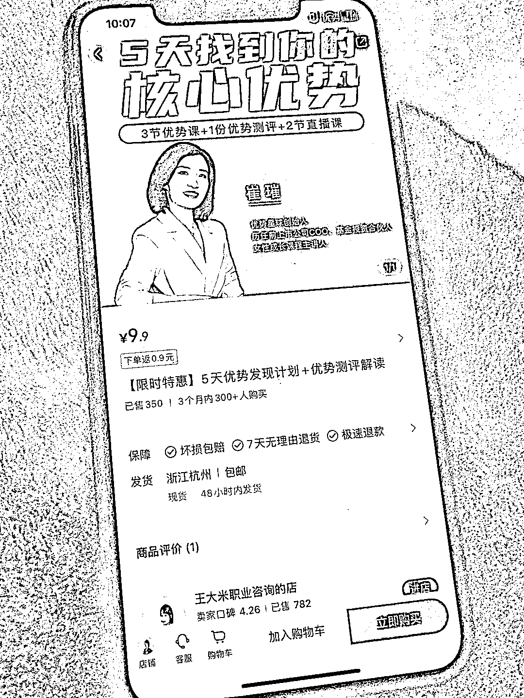
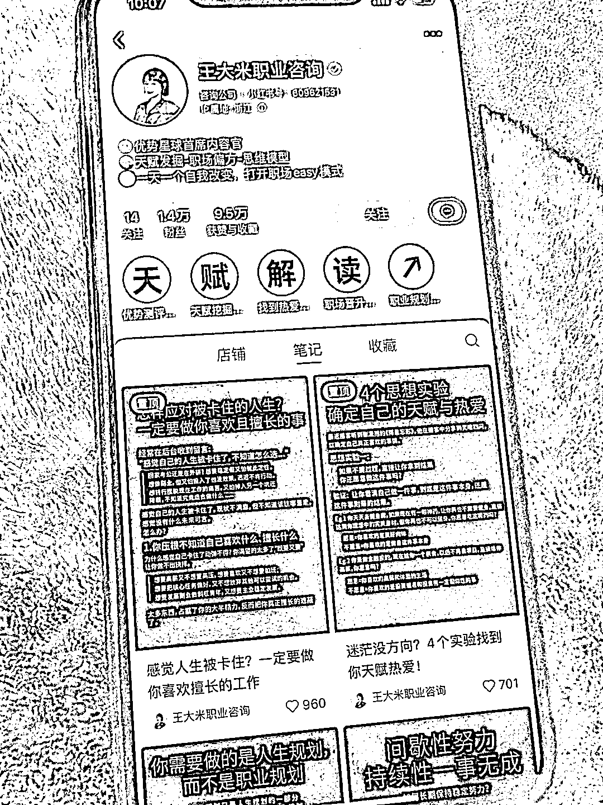

# 核心优势职业咨询课程，适用于应届毕业生和迷茫的人

> 原文：[`www.yuque.com/for_lazy/xkrm14/od329q9r6v9d6hn4`](https://www.yuque.com/for_lazy/xkrm14/od329q9r6v9d6hn4)

作者： IsnnIE

日期：2023-12-18

点赞数：**64**

* * *

正文：

找到核心优势/职业咨询 对于应届毕业生/任何迷茫的人都适用。 5 天课程也不贵只有 9.9，可以尝试，没准后续还有更多课程。
我买来看了一下，这个一期有 20 个群，5 天课程大概交付 4 万多

* * *

评论区：

南极没有北极熊 : 她的课挺好

IsnnIE : 嗯嗯 我也报了

毛豆 : 我们公司也买了她的课😂员工免费学，沟通课确实还可以。能卖 B 端也很厉害

IsnnIE : 你们公司格局可以的[强]

IsnnIE : 哇🎊 谢谢亦仁大大

* * *

公众号懒人找资源，懒人专属群分享