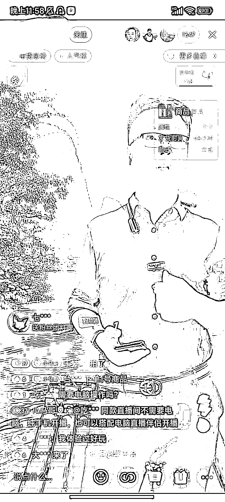
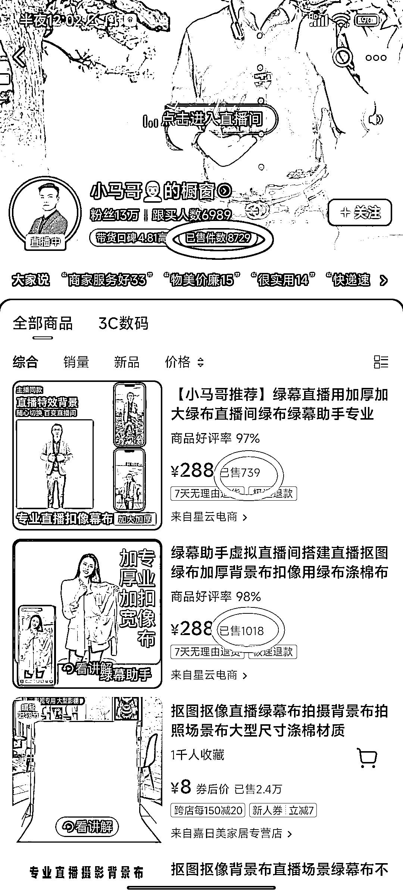

# 通过直播教学搭建虚拟直播间，带货绿幕软件以及相关设备

> 原文：[`www.yuque.com/for_lazy/xkrm14/brzk6mgdh86190wp`](https://www.yuque.com/for_lazy/xkrm14/brzk6mgdh86190wp)

作者： 徐 Ken

日期：2023-12-18

点赞数：**54**

* * *

正文：

通过直播教学搭建虚拟直播间，带货绿幕软件以及相关设备
直播间截图如图一所示，在线人数 1347 人。从橱窗数据看，已销售 8729 件商品（图二）。其中，绿幕软件（第一和第二个产品）总销量接近 1800 件，价格 288 元，通常绿幕软件的佣金 50%左右。所以，预计总佣金
= 288*1800*50%
=259200。通过查询考古加的后台数据（图三），此账号基本保持每天直播至少一场，单场 GMV 在 1 万[2.5 万的居多，按照佣金 50%计算，一天收入 5 千]1.25 万。而需要投入的就是购买绿幕软件，绿幕和手机等设备，成本不高。如果能找到合适的方法直播起号，这个项目值得尝试。

* * *

评论区：

老船长李阳 : 好多年了

徐 Ken : 说明需求很稳定，到现在都能拿到不错的收益。

老船长李阳 : [OK]是的

徐 Ken : 多谢亦仁大大

* * *

公众号懒人找资源，懒人专属群分享